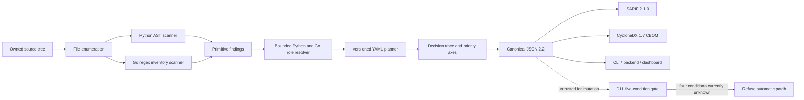

# PQMigrate beginner guide and algorithmic analysis

This guide explains PQMigrate from first principles: the problem it solves, what the original prototype did, what changed through D0–D11, how the current algorithm works, how to run it, how to read its output, and which claims are not yet supported.

## 1. The project in one sentence

PQMigrate reads source code, inventories cryptographic use, tries to determine what a cryptographic key is actually doing, and produces evidence-linked post-quantum migration advice without automatically changing the program.

It is a research prototype for **analysis and planning**. It is not currently a general automatic cryptography converter.

## 2. Why this problem matters

Public-key systems such as RSA and elliptic-curve cryptography are threatened by sufficiently capable quantum computers. A software team therefore needs to answer:

1. Where is cryptography used?
2. Which primitive is used?
3. What operation is performed?
4. What role does that operation serve in the application?
5. Which post-quantum family fits that role?
6. Can the surrounding protocol, peers, tests, and deployment support a change?

The third and fourth questions are essential. RSA is not one single purpose:

- RSA can sign data.
- RSA can verify signatures.
- RSA can encrypt or transport a session key.
- RSA can appear in a certificate or protocol identity.
- RSA can merely be imported without being used.

ML-KEM is a key-encapsulation mechanism. ML-DSA is a signature algorithm. Replacing every occurrence of RSA with ML-KEM would therefore map RSA signatures to the wrong type of primitive.

## 3. What the initial prototype did

The initial project already had valuable engineering pieces:

- Python and Go source scanning;
- registries of cryptographic imports, calls, and configuration patterns;
- a CLI that scanned files, directories, and cloned repositories;
- a numerical risk score and letter grade;
- a Spring backend and React dashboard;
- a patcher skeleton using textual replacements and `.bak` files;
- a verification skeleton that ran `pytest` and attempted rollback.

The initial flow was approximately:

```text
source text -> pattern match -> primitive name -> generic replacement -> dashboard/report
```

That proved the application could find crypto-related text and display results. It did **not** prove that it understood the operation, selected the right migration family, or could safely rewrite a real application.

The D0 audit exposed the central problem: many critical findings were imports. For example, `import rsa` proves that a module is present, but it does not prove that a key signs, encrypts, transports a secret, or is used at all.

## 4. What happened to the initial project

It was preserved and constrained, not discarded.

| Initial component | What happened |
|---|---|
| Python scanner | Kept; AST-aware discovery and bounded role analysis were added |
| Go scanner | Kept for regex inventory discovery; D4 adds Tree-sitter-backed bounded RSA role inference |
| CLI | Kept and expanded with versioned JSON, SARIF, CBOM, and rule inspection |
| Risk score/grade | Still visible as a legacy summary; it is not treated as a calibrated scientific probability |
| Spring backend | Kept; unit tests verify owner-scoped scan operations and worker failure handling |
| React dashboard | Kept; production build passes, but the CLI is the primary verified review path |
| Hard-coded migration mapping | Replaced for planning by a validated, versioned YAML knowledge base |
| Generic auto-patcher | Kept as legacy code but placed behind a fail-closed policy gate |
| `.bak` plus pytest verifier | Quarantined; missing test tools now fail closed, but isolation is still future work |

The current project asks for evidence before making a stronger statement. When evidence is missing or conflicting, it says `UNKNOWN` and abstains.

## 5. D0–D11 in plain language

| Day | Plain-language result | Current status |
|---|---|---|
| D0 | Freeze and audit the original scanner | Pass |
| D1 | Define the research question, threat model, and honest claim boundary | Pass |
| D2 | Define typed objects for findings, plans, traces, and reports | Pass |
| D3 | Add bounded Python AST role analysis | Pass |
| D4 | Add Go semantic/syntax-tree resolution | Pass for bounded same-function RSA cases |
| D5 | Track selected local key and secret flows | Pass for the bounded Python cases |
| D6 | Infer selected protocol context, especially linked JWT signing | Pass for the bounded cases |
| D7 | Move migration knowledge into validated YAML rules | Pass |
| D8 | Explain each decision with a trace and multi-axis priority | Pass |
| D9 | Measure behavior on a versioned pilot benchmark | Pass, but only as a bounded synthetic pilot |
| D10 | Export standard SARIF and CycloneDX CBOM documents | Pass locally against pinned schemas |
| D11 | Define and enforce a fail-closed patch policy | Pass; no transformation is approved |

The overall bounded status is `PASS`. General cross-file and interprocedural Go analysis remains outside the D4 claim.

## 6. Current architecture



### Trust boundary

The scanned repository is untrusted input. The scanner reads source text and parses it; it must not import or execute target Python modules. Exported reports are evidence, not authorization to edit source. A future test runner or interoperability laboratory is a separate trust boundary.

## 7. A concrete example

Consider three files.

### Case A: RSA signing a JWT

```python
signing_key = rsa.generate_private_key(public_exponent=65537, key_size=2048)
token = jwt.encode({"sub": "demo"}, signing_key, algorithm="RS256")
```

The analyzer records `signing_key` as the result of RSA key generation. It then sees the exact variable passed to `jwt.encode` with an `RS*` algorithm. It can therefore emit:

```text
role: signature
operation: sign
protocol_context: jwt
confidence: inferred/direct linked evidence
advice: assess ML-DSA and JWT/verifier compatibility
patch_available: false
```

### Case B: RSA transporting a generated session key

```python
transport_key = rsa.generate_private_key(public_exponent=65537, key_size=2048)
session_key = os.urandom(32)
wrapped = transport_key.public_key().encrypt(session_key, padding)
```

The analyzer tracks both the RSA key and the locally generated secret. Because the secret flows into RSA encryption, the bounded model calls this `key_transport` and recommends assessing a protocol-level KEM/DEM redesign using ML-KEM.

It does not perform a textual RSA-to-ML-KEM replacement. The decrypting peer, stored format, and protocol must also change.

### Case C: RSA import only

```python
from cryptography.hazmat.primitives.asymmetric import rsa
```

No key use is proven. The output is an inventory lead with role `unknown`, and the planner abstains.

## 8. The current algorithm

### Inputs

- a local file or directory, or a repository cloned by the CLI;
- the Python and Go detection registries;
- the D7 YAML migration knowledge base;
- CLI options selecting console, Markdown, JSON, SARIF, or CBOM output.

### Outputs

- source location and primitive;
- role, operation, confidence, detection type, and protocol context;
- a rule-versioned advisory plan or abstention;
- blocker codes and standards references;
- a deterministic five-stage decision trace;
- multi-axis review priority;
- versioned JSON plus optional SARIF or CBOM.

### Pseudocode

```text
ANALYZE(root):
  files = enumerate supported, non-ignored source files under root
  findings = []

  for each Python file:
    source = read as text without executing it
    tree = parse source into an abstract syntax tree
    emit supported import, call, and configuration observations

    for each supported RSA observation:
      collect same-scope key-generation assignments
      collect same-scope generated-secret assignments
      link the tracked key to supported consumer calls

      if the exact key reaches jwt.encode with an RS* algorithm:
        role = SIGNATURE
        context = JWT
      else if RSA encrypt consumes a tracked generated secret:
        role = KEY_TRANSPORT
      else if linked roles conflict:
        role = UNKNOWN
      else:
        role = UNKNOWN

      preserve source spans and evidence

  for each Go file:
    apply the bounded regex registry
    emit detection leads without claiming semantic role resolution

  for each finding:
    match a versioned YAML rule using typed facts
    if facts are missing or conflicting:
      abstain
    create priority axes and five-stage decision trace

  return versioned ProjectReport
```

### Five decision-trace stages

1. **Detection:** what source observation was found?
2. **Role inference:** was a role linked, or is it unknown/conflicting?
3. **Rule match:** which exact rule and version matched?
4. **Blocker assessment:** which protocol, format, test, or deployment facts are missing?
5. **Decision:** recommend an assessment or abstain.

The trace ID is deterministic for equivalent semantic input, rule version, and source commit. Random scan IDs and timestamps are not used to pretend that the same decision is different.

## 9. Formal role model

Let `x` be one crypto observation. Let `E(x)` be its evidence: resolved imports, AST source spans, assignments, bounded flow links, and supported consumer calls.

Define the role function:

```text
rho(x) = SIGNATURE
  if a resolved signing operation consumes the tracked key

rho(x) = KEY_TRANSPORT
  if RSA encryption consumes a tracked locally generated session secret

rho(x) = UNKNOWN
  if neither condition holds, or if observed roles conflict
```

This is conservative. It prefers an explicit unknown to an unjustified answer.

### Informal soundness property for the bounded fixtures

For the supported patterns, the tool should not return `SIGNATURE` merely because JWT code is nearby. The same tracked key must reach the supported signing sink. Similarly, it should not return `KEY_TRANSPORT` merely because RSA encryption exists; the encrypted value must be a tracked generated session secret.

This is a property of the bounded rules, not proof of soundness for all Python programs.

## 10. Patch eligibility model

Knowing the role does not prove that mutation is safe. D11 defines five independent conditions:

```text
K = role is known
S = exact replacement construction is approved and supported
I = peers, protocols, files, and deployments are interoperable
T = adequate isolated tests are available
O = an operator explicitly authorizes this exact diff
```

Each value is `true`, `false`, or `unknown`.

```text
AutoEligible(x) = K AND S AND I AND T AND O
```

There are `3^5 = 243` possible assignments. Only one assignment—five true values—is eligible. The exhaustive test confirms that the other 242 assignments are refused.

Current reports can sometimes establish `K`. They do not independently establish `S`, `I`, `T`, or `O`, so automatic mutation remains disabled. A crafted report containing `patch_available=true` is not trusted.

## 11. Algorithmic complexity

Define:

- `B`: total source bytes read;
- `N`: total Python AST nodes;
- `M`: number of accepted files;
- `P`: number of regex patterns tested for Go;
- `F`: emitted findings;
- `D`: bounded dataflow links examined;
- `R`: migration rules, currently nine.

| Stage | Time | Additional memory | Meaning |
|---|---:|---:|---|
| File enumeration | approximately `O(M)` entries, plus path/ignore work | `O(M)` worst case if retained | Visit candidate files |
| Reading source | `O(B)` | up to file size | Source is read, not executed |
| Python parse and AST traversal | approximately `O(N)` | `O(N)` | Build and walk each AST |
| Bounded Python role inference | `O(N + D)` with indexed variable sets | `O(N + D)` | Track selected names and supported calls in local scopes |
| Go regex inventory detection | approximately `O(P × B_go)` for ordinary bounded patterns | dependent on matches | Produces inventory leads, not roles |
| Tree-sitter Go parsing and bounded role inference | approximately `O(N_go + D_go)` | `O(N_go + D_go)` | Alias-aware, same-function RSA cases; unsupported flow abstains |
| Rule planning | `O(F × R)` | `O(F)` | With nine rules, effectively bounded but still expressed honestly |
| Trace/report construction | `O(F)` plus serialized output size | `O(F)` | One assurance record per finding |
| SARIF/CBOM mapping | `O(F)` before schema validation | `O(F)` | Convert the canonical report |
| D11 exhaustive gate audit | `O(3^5) = O(243)` | constant for five conditions | Exhaustive because the state space is deliberately small |

For a fixed rule registry and the bounded Python implementation, the dominant work is reading and parsing source. These asymptotic expressions are design analysis, not measured performance results. Wall-clock time, hardware, repository size, parser failures, and ignored-file coverage must be reported separately.

## 12. Priority model

The original scalar risk score and letter grade remain in the legacy console path. They are useful for a simple summary but must not be presented as a calibrated probability or universal scientific risk value.

The research-facing planner uses explainable axes:

- cryptographic urgency;
- evidence strength;
- migration effort;
- data exposure;
- overall review priority.

Unknown business facts remain unknown. For example, the scanner does not guess data sensitivity or retention time from source code.

## 13. D9 evaluation and the meaning of the numbers

The pilot dataset contains 72 authored Python RSA cases with train/dev/test labels. Four parse failures are reported separately, leaving 68 evaluated cases.

For operation detection:

```text
TP = 40
FP = 0
FN = 12
TN = 16
```

Therefore:

```text
precision = TP / (TP + FP) = 40 / 40 = 1.0
recall    = TP / (TP + FN) = 40 / 52 = 0.769231
F1        = 2PR / (P + R) = 0.869565
```

Role resolution answered 40 of 52 gold operations and was correct on those 40 answered cases:

```text
answer coverage = 40 / 52 = 0.769231
accuracy among answered = 40 / 40 = 1.0
end-to-end role accuracy = 40 / 52 = 0.769231
```

The 12 false negatives are important evidence: parameter and alias flows exceed the current bounded analysis. The results apply only to the single-author synthetic Python RSA pilot. They do not establish accuracy on arbitrary repositories, Go, all cryptographic APIs, or safe migration.

## 14. Data model and report structure

The canonical report is `ProjectReport` schema 2.2.

```text
ProjectReport
  metadata: schema, scan ID, scanner version, rules version, source commit
  records[]
    finding
      primitive, location, role, operation, status, confidence, context
    plan
      target family, standard, blocker codes, rule provenance
      priority axes
      decision trace
    tests_passed
    verified_by_human
```

The report deliberately separates a finding from a migration plan. Detecting something is not the same as proving a replacement.

## 15. Output formats

### Console

Human-readable summary with legacy risk counts and grade.

### Canonical JSON

The complete PQMigrate evidence and planning structure. This is the source used to generate the external formats.

### Markdown

A readable issue/report form.

### SARIF 2.1.0

Maps findings, rule IDs, locations, severity, fingerprints, trace IDs, blockers, and advisory state into a standard static-analysis format. It is locally validated against the pinned official OASIS schema.

### CycloneDX 1.7 CBOM

Represents findings as cryptographic assets with call-stack evidence and PQMigrate namespaced properties. The composition is marked incomplete because supported-pattern coverage is bounded. It is locally validated against the pinned official CycloneDX schema.

Source snippets are excluded from SARIF and CBOM exports.

## 16. How to run the project

### Show commands

```bash
cd /home/ratneshp0411/pqc_migration_tool
../venv/bin/python3 cli.py
```

### Scan a local directory

```bash
../venv/bin/python3 cli.py scan tests/fixtures/review \
  --format json \
  --output /tmp/pqmigrate-report.json
```

Exit code `1` is expected when critical or high findings are detected. In this CLI, it is a policy result, not necessarily a program crash.

### Read the report

```bash
python3 -m json.tool /tmp/pqmigrate-report.json
```

Look for:

- `schema_version` and `source_commit`;
- `finding.role`, `operation`, `confidence`, and `protocol_context`;
- `plan.rule_id` and `rule_version`;
- `plan.blocker_codes` and `standard_refs`;
- `plan.decision_trace.steps`;
- `plan.patch_available`, which must remain false in current plans.

### List active rules

```bash
../venv/bin/python3 cli.py list-rules
```

### Export SARIF and CBOM

```bash
../venv/bin/python3 cli.py export /tmp/pqmigrate-report.json \
  --format sarif --output /tmp/pqmigrate.sarif.json

../venv/bin/python3 cli.py export /tmp/pqmigrate-report.json \
  --format cbom --output /tmp/pqmigrate.cdx.json
```

### Run the benchmark

```bash
scripts/run_benchmark.sh
```

### Audit patch logic

```bash
cd /home/ratneshp0411
venv/bin/python3 -m pqc_migration_tool.patcher.policy_audit
```

### Validate all D0–D11 evidence

```bash
cd /home/ratneshp0411/pqc_migration_tool
scripts/validate_d0_d11.sh
```

Expected overall result:

```text
PASS
```

All declared D0–D11 milestones pass their bounded acceptance checks.

## 17. Backend and dashboard

The Spring backend stores and serves scan evidence, while the React frontend displays it. Unit tests currently verify selected backend owner-scoping and worker-output failure behavior. The frontend production build passes.

For the faculty review, the CLI and committed artifacts are the primary verified evidence path. Do not claim that every authenticated browser-to-worker-to-dashboard action has been end-to-end tested unless a separate browser smoke test is added and passes.

The frontend build currently reports a non-fatal warning because the main JavaScript bundle is larger than 500 kB.

## 18. What works today

- Python source discovery and supported AST detections;
- Go inventory discovery and bounded Tree-sitter RSA role inference;
- bounded same-scope RSA key tracking;
- linked JWT signing classification;
- linked generated-session-key transport classification;
- unknown/conflict abstention;
- versioned YAML migration advice;
- deterministic evidence traces and priority axes;
- versioned JSON, SARIF, and CBOM;
- reproducible pilot benchmark;
- exhaustive fail-closed patch gate;
- backend unit tests and frontend production build;
- one-command D0–D11 validation.

## 19. What does not work yet

- general cross-file, interprocedural, interface and wrapper-aware Go role inference;
- general interprocedural or cross-file Python dataflow;
- broad alias and parameter-flow handling;
- independent benchmark labelling or real-project generalization;
- complete skipped/generated/vendor/parser-error coverage accounting in the canonical report;
- approved automatic transformations;
- isolated disposable-worktree or container verification;
- demonstrated TLS, SSH, JWT, certificate, stored-data, or peer interoperability;
- confirmed import into every third-party SARIF/CBOM consumer;
- a fully verified browser end-to-end workflow;
- publication-quality scientific conclusions.

## 20. The review claim

A defensible statement is:

> PQMigrate is a bounded, evidence-linked static-analysis prototype for role-aware post-quantum migration planning. On controlled Python RSA cases, it distinguishes selected JWT signing and generated-session-key transport operations from unresolved imports, records a deterministic decision trace, exports standard evidence formats, and refuses source mutation when required facts are unknown.

An indefensible statement is:

> PQMigrate automatically converts any Python or Go repository to secure post-quantum cryptography.

## 21. What to learn for the algorithm-analysis review

Be able to explain these five ideas without slides:

1. **Primitive is not role.** RSA does not tell us signature versus key transport.
2. **Evidence linking matters.** The exact tracked variable must reach a supported operation.
3. **Unknown is a result.** Abstention prevents an invented migration answer.
4. **Planning and patching are separate.** A recommendation is not mutation authority.
5. **Evaluation has scope.** The D9 numbers describe one synthetic pilot, not the whole world.

If asked whether the mathematical model proves patches secure, answer:

> It proves a limited fail-closed decision-gate property: any false or unknown required condition prevents eligibility. Detection accuracy, recommendation correctness, generated-patch behavior, and interoperability require separate experiments.

## 22. Recommended next decision

The next engineering decision is whether to expand the Go resolver beyond its bounded same-function RSA scope or begin D12 real-project evaluation. Do not describe the current D4 pass as general Go program understanding.
