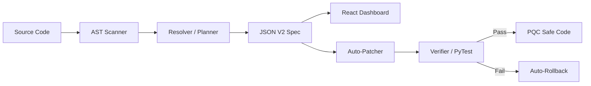

# 🛡️ PQMigrate: Post-Quantum Cryptography Migration Tool

[](https://csrc.nist.gov/projects/post-quantum-cryptography)
[](https://python.org)
[](https://reactjs.org)

**PQMigrate** is an enterprise-grade, AST-aware static analysis and automated remediation tool designed to transition legacy cryptographic primitives (RSA, ECC, AES-128) to NIST-standardized Post-Quantum Cryptography (PQC).

Unlike naive regex search tools, PQMigrate uses Abstract Syntax Tree (AST) dataflow tracking to infer the *semantic role* of a cryptographic primitive (e.g., distinguishing between a signing operation and an encryption operation) to safely generate and apply FIPS-compliant code patches.

---

## ✨ Key Capabilities

1. **Deep AST Analysis (`/scanner`)**: Traces variable assignments and method calls (e.g., `.sign()`, `.encrypt()`) to understand cryptographic intent.
2. **Deterministic Planner (`/resolver`)**: Maps legacy algorithms to FIPS 203 (ML-KEM) and FIPS 204 (ML-DSA). Enforces **ADR-001**, explicitly abstaining from patching if a variable's usage is ambiguous.
3. **Assurance Dashboard (`/dashboard`)**: A standalone React dashboard that visualizes cryptographic vulnerabilities, distinguishing between automated patch targets and manual review requirements.
4. **Auto-Patcher & Verifier (`/patcher` & `/verification`)**: Safely injects PQC wrappers into source code. Automatically runs unit tests post-patch and triggers an instant `.bak` rollback if the patch breaks the build.

---

## 🏗️ Architecture Pipeline



---

## 🚀 Quick Start (Demo Script)

### 1. Installation
```bash
git clone https://github.com/Ratneshp1122/PQMigrate.git
cd PQMigrate
python3 -m venv venv
source venv/bin/activate
pip install -r requirements.txt
```

### 2. Generate a Migration Plan
Scan a target directory and export the FIPS-compliant migration plan:
```bash
python3 cli.py scan demo/ --format json --output report_v2.json
```

### 3. Launch the Assurance Dashboard
Spin up the visual dashboard to review vulnerabilities and abstentions:
```bash
python3 -m http.server 8080
# Open http://localhost:8080/dashboard/index.html in your browser
```

### 4. Execute Auto-Patching & Verification
Apply the migration plan to the source code. The `--verify` flag ensures that if the tests fail, the code is instantly rolled back.
```bash
python3 cli.py patch report_v2.json --verify
```

---

## 📜 Supported Cryptographic Mappings

| Legacy Primitive | Vulnerability | NIST PQC Standard Target | Role |
| :--- | :--- | :--- | :--- |
| **RSA / ECDH** | Shor's Algorithm | **FIPS 203 (ML-KEM)** / RFC 10024 | Key Encapsulation |
| **RSA / ECDSA** | Shor's Algorithm | **FIPS 204 (ML-DSA)** | Digital Signatures |
| **AES-128** | Grover's Algorithm | **AES-256** | Symmetric Encryption |
| **SHA-1 / MD5** | Collision Attacks | **SHA-256 / SHA-3** | Hashing |

---

## 🛑 Architectural Decision Records (ADRs)

* **ADR-001 (Semantic Abstention):** PQMigrate operates under strict "Do No Harm" compliance. If the AST parser identifies an import (e.g., `import rsa`) but cannot trace its execution flow to a specific cryptographic role, the planner assigns an `ABSTAIN` status. The tool will *never* blindly overwrite code without semantic confidence.

---
*Developed for advanced cryptographic modernization workflows.*
