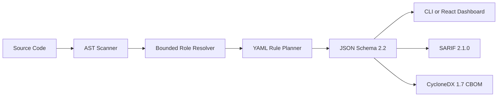

# 🛡️ PQMigrate: Post-Quantum Cryptography Migration Tool

[](https://csrc.nist.gov/projects/post-quantum-cryptography)
[](https://python.org)
[](https://reactjs.org)

**PQMigrate** is a research prototype for AST-aware cryptographic inventory and evidence-linked post-quantum migration planning.

New to the project? Open [`START_HERE.md`](START_HERE.md), then [`PQMIGRATE_FULL_GUIDE.md`](PQMIGRATE_FULL_GUIDE.md) for the original-prototype history, current pipeline, worked examples, mathematical model, complexity analysis, commands, outputs, and limitations.

The Python and Go paths use bounded syntax-tree dataflow to distinguish selected RSA signing and key-transport cases from unresolved imports. Go discovery remains regex-based, but D4 role inference is Tree-sitter-backed and alias-aware. A versioned YAML knowledge base produces advisory plans with blocker codes and standards references. The planner abstains when evidence is missing or conflicting and does not treat role inference as authorization to patch.

---

## ✨ Key Capabilities

1. **Syntax-aware discovery (`/scanner`)**: Detects supported Python operations and inventory leads; Go inventory discovery uses bounded regex patterns.
2. **Bounded role inference (`/resolver`)**: Links selected same-scope Python and Go RSA key uses. The Go path uses Tree-sitter and explicitly handles aliases, shadowing, malformed source, unrelated keys, absent use and conflicting evidence.
3. **Versioned rule planning (`/knowledge`)**: Loads validated YAML rules with rule IDs, blocker codes, standards references, and advisory-only decisions.
4. **Assurance interface (`/backend` and `/frontend`)**: Stores and displays scan evidence. The CLI remains the primary verified review path.
5. **Pilot evaluation (`/benchmarks`)**: Runs a versioned 72-case synthetic Python RSA benchmark with held-out splits, raw predictions, metrics, and error cases.
6. **Standards export (`/exporters`)**: Emits schema-validated SARIF 2.1.0 and CycloneDX 1.7 CBOM without source snippets or automatic-patch claims.
7. **Fail-closed patch policy (`/patcher/policy.py`)**: Evaluates five independent three-valued conditions; all current reports remain ineligible for mutation.

---

## 🏗️ Architecture Pipeline


```mermaid
graph LR
    A[Source Code] --> B[AST Scanner]
    B --> C[Bounded Role Resolver]
    C --> D[YAML Rule Planner]
    D --> E[JSON Schema 2.2]
    E --> F[CLI or React Dashboard]
    E --> G[SARIF 2.1.0]
    E --> H[CycloneDX 1.7 CBOM]
```

---

## 🚀 Quick Start (Demo Script)

### 1. Installation
```bash
git clone https://github.com/Ratneshp1122/PQMigrate.git
cd PQMigrate
python3 -m venv venv
source venv/bin/activate
pip install -r requirements.txt
```

### 2. Generate a Migration Plan
Scan a target directory and export a standards-referenced advisory plan:
```bash
python3 cli.py scan demo/ --format json --output report_v2.json
```

### 3. Launch the Assurance Dashboard
Spin up the visual dashboard to review vulnerabilities and abstentions:
```bash
python3 -m http.server 8080
# Open http://localhost:8080/dashboard/index.html in your browser
```

### 4. Run the review smoke suite
Run the Python tests, Maven tests, frontend build, and controlled three-fixture scan:
```bash
scripts/review_smoke.sh
```

### 5. Run the D9 pilot benchmark

```bash
scripts/run_benchmark.sh
```

The generated metrics apply only to the committed single-author synthetic Python RSA pilot. They are not product-wide or publication-quality accuracy claims.

### 6. Export SARIF and CBOM

Export directly during a scan, or convert one canonical JSON report into both formats:

```bash
python3 cli.py scan demo/ --format sarif --output report.sarif.json
python3 cli.py scan demo/ --format cbom --output report.cdx.json
python3 cli.py export report_v2.json --format sarif --output report.sarif.json
python3 cli.py export report_v2.json --format cbom --output report.cdx.json
```

Exports are validated offline against pinned official schemas before being written. See `docs/review/d10-standards-exports.md` for field mappings and limitations.

### 7. Audit the D11 patch gate

```bash
cd ..
python3 -m pqc_migration_tool.patcher.policy_audit
```

The audit checks all 243 assignments of the five three-valued conditions. Exactly the all-true vector is theoretically eligible; the current pipeline cannot supply the other four trusted conditions and therefore cannot mutate source. See `docs/review/d11-patch-safety-policy.md`.

### 8. Reproduce D0–D11 evidence

```bash
scripts/validate_d0_d11.sh
```

This runs the complete test/build/export/audit path and writes a machine-readable milestone matrix under `review-artifacts/latest/`. The accurate bounded result is `PASS`: D4 now includes Tree-sitter Go parsing and same-function RSA role inference. See `docs/D0-D11_REPRODUCIBILITY.md` for the exact claim boundary.

---

## 📜 Supported Cryptographic Mappings

| Legacy Primitive | Vulnerability | NIST PQC Standard Target | Role |
| :--- | :--- | :--- | :--- |
| **RSA / ECDH** | Shor's Algorithm | **FIPS 203 (ML-KEM)** / RFC 10024 | Key Encapsulation |
| **RSA / ECDSA** | Shor's Algorithm | **FIPS 204 (ML-DSA)** | Digital Signatures |
| **AES-128** | Grover's Algorithm | **AES-256** | Symmetric Encryption |
| **SHA-1 / MD5** | Collision Attacks | **SHA-256 / SHA-3** | Hashing |

---

## 🛑 Architectural Decision Records (ADRs)

* **ADR-001 (Semantic Abstention):** If the analyzer cannot link a primitive to a supported role, the planner emits an abstention with explicit blocker codes.
* **D7 rule safety:** The YAML loader rejects duplicate rule IDs, unsupported role names, missing provenance fields, and any D7 rule that enables automatic patching.
* **D11 mutation safety:** Report-supplied eligibility claims are not trusted. Missing, false, or unknown gate evidence refuses mutation, and missing verification tools fail closed.

---
*Developed for advanced cryptographic modernization workflows.*
