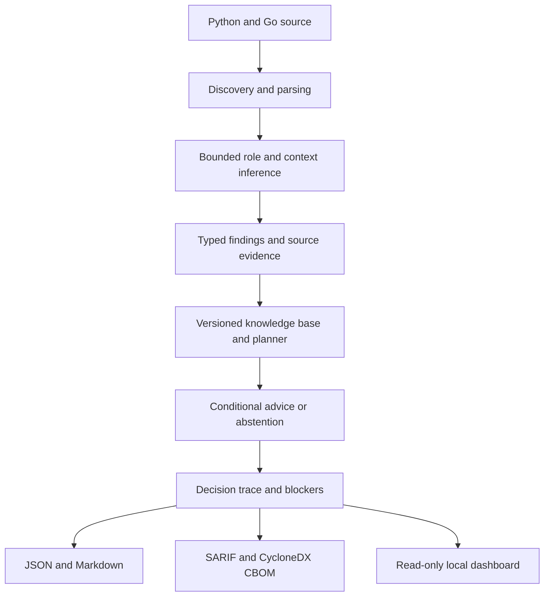

# PQMigrate

**Evidence-driven and abstention-aware planning for post-quantum cryptographic migration.**

PQMigrate is a research prototype that scans source code, identifies supported cryptographic uses, and produces evidence-linked migration advice. It distinguishes an algorithm reference from a resolved operation: an RSA import alone does not establish whether the application signs messages, encrypts data, or transports a key.

The implementation combines bounded Python and Go analysis, a versioned knowledge base, explicit abstention, traceable reports, and a local review dashboard. **Current migration decisions are advisory; automatic source mutation is disabled.**

## Implemented capabilities

| Capability | Current behavior |
|---|---|
| Cryptographic discovery | Python syntax-aware scanning and bounded Go inventory matching produce findings and inventory leads. |
| Role and context inference | Selected Python and Go RSA uses are linked to same-scope evidence. Go semantic inference uses Tree-sitter. Unsupported or conflicting evidence remains unresolved. |
| Advisory migration rules | Validated YAML rules supply rule IDs, versions, target families, standards references, manual-review requirements, and blocker codes. |
| Decision traces | Findings retain source locations, inference evidence, rule matches, unresolved requirements, and deterministic semantic trace identifiers. |
| Report exports | Canonical JSON, Markdown, schema-validated SARIF 2.1.0, and CycloneDX 1.7 CBOM. |
| Mutation policy | Five three-valued conditions govern eligibility. Missing or unknown requirements refuse application; report-supplied eligibility is not trusted. |
| Bounded preview | Hash-bound preview of a supported direct Python MD5-to-SHA-256 expression change, without editing the original source. |
| Isolated verification | Syntax and structural checks in a disposable copy, source-hash preservation, timeout handling, and cleanup evidence. |
| Compatibility laboratory | Two-party digest-contract checks covering agreement, fallback, no common mode, and tampered digests. |
| Local dashboard | Read-only findings, evidence, advisory plans, preview, assurance ledger, exports, and optional comparison of two manifests. |
| Evaluation | A 72-case synthetic Python RSA pilot, same-corpus baselines, output-masking sensitivity checks, and raw prediction/error records. |
| Integration validation | An ordered D0-D20 gate that runs tests and builds, regenerates evidence, and writes a manifest with source-commit and artifact hashes. |

## How it works


```mermaid
flowchart TD
    A[Python and Go source] --> B[Discovery and parsing]
    B --> C[Bounded role and context inference]
    C --> D[Typed findings and source evidence]
    D --> E[Versioned knowledge base and planner]
    E --> F[Conditional advice or abstention]
    F --> G[Decision trace and blockers]
    G --> H[JSON and Markdown]
    G --> I[SARIF and CycloneDX CBOM]
    G --> J[Read-only local dashboard]
```

For example, a supported RSA signing operation can produce an ML-DSA assessment advisory. RSA encryption of a tracked generated secret can produce a key-transport advisory for KEM-based redesign. An unresolved import or conflicting role produces abstention. These are review decisions, not verified algorithm substitutions.

## Quick start

Use Linux or WSL with Git and Python 3.10 or newer. The complete integration gate additionally requires Java 21, Maven, Node.js, and npm.

### 1. Install

Clone into the exact directory name below: the CLI and validation scripts import the package as `pqc_migration_tool`.

```bash
git clone https://github.com/Ratneshp1122/PQMigrate.git pqc_migration_tool
cd pqc_migration_tool
python3 -m venv .venv
source .venv/bin/activate
python3 -m pip install -r requirements-dev.txt
```

`requirements-dev.txt` includes the runtime dependencies and pytest. Keep the virtual environment active while running the commands below.

### 2. Inspect supported patterns and rules

```bash
python3 cli.py list-patterns
python3 cli.py list-rules
```

### 3. Scan the review fixtures

```bash
python3 cli.py scan tests/fixtures/review --format json --output report.json
```

Replace `tests/fixtures/review` with the file or source directory to inspect. The generated report contains findings, evidence, advisory decisions, and blockers.

**Exit status:** a completed scan can return `1` when critical/high findings are present. The review fixture scan is expected to do so; inspect the output and saved report rather than interpreting that status alone as a scanner crash.

### 4. Open the read-only dashboard

```bash
python3 cli.py dashboard --input report.json --source-root . --bind 127.0.0.1 --port 8765
```

Open <http://127.0.0.1:8765>. The dashboard serves the saved manifest, binds to loopback, and has no source-upload or apply action. For source excerpts, set `--source-root` to the root of the scanned project.

To compare against an existing earlier report:

```bash
python3 cli.py dashboard --input report.json --compare previous.json --source-root .
```

### 5. Export the same report

```bash
python3 cli.py export report.json --format sarif --output report.sarif.json
python3 cli.py export report.json --format cbom --output report.cdx.json
```

Exports are checked against pinned schemas. SARIF and CBOM do not include source snippets. CBOM inventory completeness is explicitly marked incomplete.

## Validation and reproduction

From the repository root, with the virtual environment active:

```bash
npm ci --prefix frontend
bash scripts/validate_d0_d20.sh
```

The gate runs the D0-D11 checks, preview and disposable verification, digest interoperability laboratory, local dashboard checks, static-site checks, baseline evaluation, and release-packet audit. It stops on failure and writes the successful integration summary only after its component scripts complete.

Generated evidence is stored under `review-artifacts/latest/`, including:

- `python-pytest.log`, `day5-scanner-checks.log`, `backend-maven-test.log`, and `frontend-build.log`;
- canonical JSON, SARIF, and CBOM review reports;
- `d9-benchmark-results.json` and `d18-baselines.json` with raw predictions and metrics;
- preview, verification, interoperability, and dashboard artifacts;
- `d20-integration-summary.json` with the source commit, artifact hashes, and deployment scope.

The completed validation of commit [`bcfb5e4`](https://github.com/Ratneshp1122/PQMigrate/commit/bcfb5e40fbc8eb74e1c919114f54031d03ab44e9) passed twice from a clean detached checkout. Its logs recorded **97 Python tests, 23 legacy scanner checks, five Maven tests, and a successful frontend production build**, plus the milestone checks. These counts describe that recorded implementation revision, not a live CI badge or a security certification.

For an exact reproduction, check out that commit in a separate clone before installing dependencies and running the gate. Generated evidence changes files under the artifact directory; preserve run output separately when auditing a clean source revision.

### Focused commands

```bash
# Python checks
python3 -m pytest -q

# Synthetic pilot
bash scripts/run_benchmark.sh

# Same-corpus comparisons
bash scripts/run_d18_baselines.sh

# Bounded preview and disposable verification evidence
bash scripts/run_d12_preview.sh
bash scripts/run_d13_verification.sh

# Controlled two-party digest compatibility experiment
python3 cli.py interop-lab --repeats 20 --output interop-results.json
```

The compatibility experiment evaluates a digest contract. It does not establish ML-KEM, ML-DSA, TLS, or hybrid-PQC interoperability.

## Completed pilot results

PQMigrateBench v0.1 contains **72 single-author synthetic Python RSA cases**: 52 operation cases, 16 negative controls, and four malformed-input cases. Detection and role scores use the 68 parseable cases; malformed inputs are accounted for separately. Unsupported valid operations remain in the operation denominator.

| Configuration | Detection precision | Detection recall | Detection F1 | Role accuracy among answered gold operations | End-to-end role accuracy |
|---|---:|---:|---:|---:|---:|
| Lexical RSA lookup | 0.714 | 0.769 | 0.741 | No role output | No role output |
| AST method matching | 0.917 | 0.846 | 0.880 | 0.727 | 0.615 |
| Session-secret output mask | 1.000 | 0.769 | 0.870 | 0.700 | 0.538 |
| Protocol output mask | 1.000 | 0.769 | 0.870 | 1.000 | 0.769 |
| Full bounded resolver | 1.000 | 0.769 | 0.870 | 1.000 | 0.769 |

The full resolver answers 40 of 52 gold operations with correct roles and leaves 12 unsupported operations unanswered. It produces zero operation false positives on the 16 negative controls. The author-defined supported/unsupported mix largely determines this recall, and the authored negative controls and selected supported cases limit what the zero-error counts establish. The AST baseline has slightly higher reported F1 and correctly resolves the 12 unsupported-category cases; the full resolver has higher conditional role accuracy across its selected answers.

The two output masks reuse full-resolver predictions and remove role/context information; they are not experiments that disable internal analysis stages. The full resolver's positive detection is defined by a known role, so its detection and role metrics are coupled. Lexical lookup supplies no role answer. The pilot's train/development/test assignments are synthetic partitions, not independent repository holdouts. Scores apply to snippet-level Python RSA role inference, not Go accuracy, full-project coverage, or migration-recommendation safety. The pilot has no independent annotation or population-valid confidence intervals.

## Current scope and limitations

- **Bounded static analysis:** supported patterns and local evidence do not establish complete program behavior. Unsupported wrappers, aliasing, reassignment, or cross-function flow can remain unresolved or exceed the analyzer's assumptions.
- **Advisory output:** a target family is conditional advice. The implementation does not provide validated automatic RSA-to-PQC transformation.
- **Narrow verification:** syntax/AST checks in a temporary copy do not prove application semantics; the disposable directory is not a full security sandbox.
- **Inventory limits:** schema-valid exports do not prove complete discovery or successful ingestion by every external platform.
- **Local operation:** the CLI is validated in WSL; the dashboard is loopback-only. The static website is a local preview, the Spring backend has test evidence, and the React frontend has build evidence. Public production deployment is not established.
- **Engineering versus security evidence:** passing the integration gate does not certify cryptographic security or production release readiness.

## Repository guide

| Path | Purpose |
|---|---|
| `cli.py` | Scan, export, preview, verification, laboratory, and dashboard commands |
| `scanner/`, `resolver/`, `schema/` | Discovery, bounded inference, and typed findings |
| `knowledge/` | Versioned advisory rules |
| `report/`, `exporters/` | Reports and standards-based exports |
| `patcher/`, `verification/`, `lab/` | Eligibility policy, bounded preview, verification, and digest laboratory |
| `dashboard/` | Read-only local evidence workbench |
| `backend/`, `frontend/` | Spring backend and React frontend |
| `website/` | Static project website |
| `benchmarks/`, `experiments/` | Pilot corpus, evaluation, and baseline comparisons |
| `tests/`, `scripts/` | Fixtures, automated checks, and reproduction commands |
| `docs/`, `review-artifacts/` | Technical documentation and generated evidence |

## Documentation

- [Start here](START_HERE.md)
- [Full working guide](PQMIGRATE_FULL_GUIDE.md)
- [Go semantic analysis](docs/review/d4-go-semantic.md)
- [Versioned knowledge base](docs/review/d7-knowledge-base.md)
- [Decision traces](docs/review/d8-decision-trace.md)
- [Pilot benchmark](docs/review/d9-benchmark.md)
- [SARIF and CBOM exports](docs/review/d10-standards-exports.md)
- [Patch eligibility policy](docs/review/d11-patch-safety-policy.md)
- [Bounded preview](docs/review/d12-preview.md) and [disposable verification](docs/review/d13-isolated-verification.md)
- [Digest interoperability laboratory](docs/review/d14-interoperability-lab.md)
- [Local dashboard](docs/review/d15-local-dashboard.md) and [assurance views](docs/review/d16-dashboard-assurance.md)
- [Same-corpus baseline evaluation](docs/review/d18-baselines-ablations.md)
- [D0-D20 integration gate](docs/review/d20-integration-release-gate.md)
