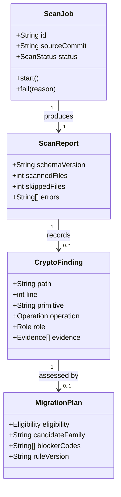
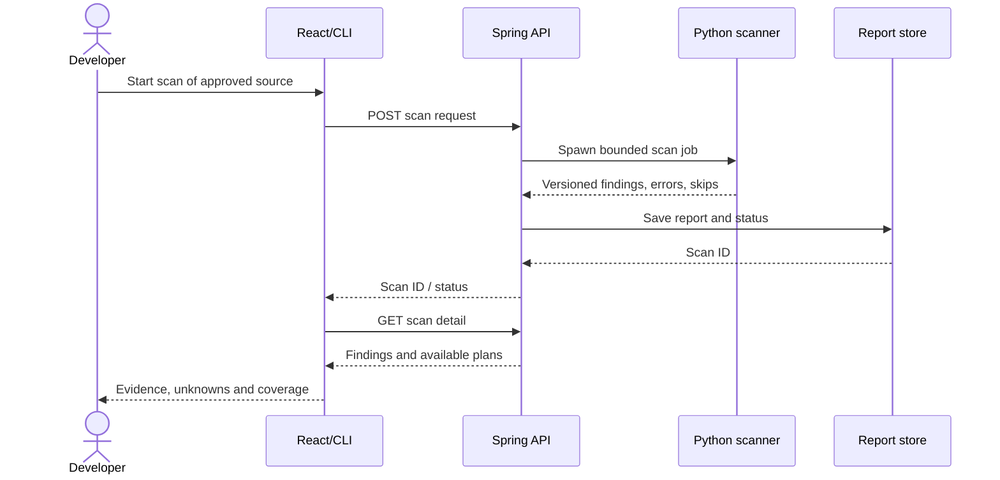
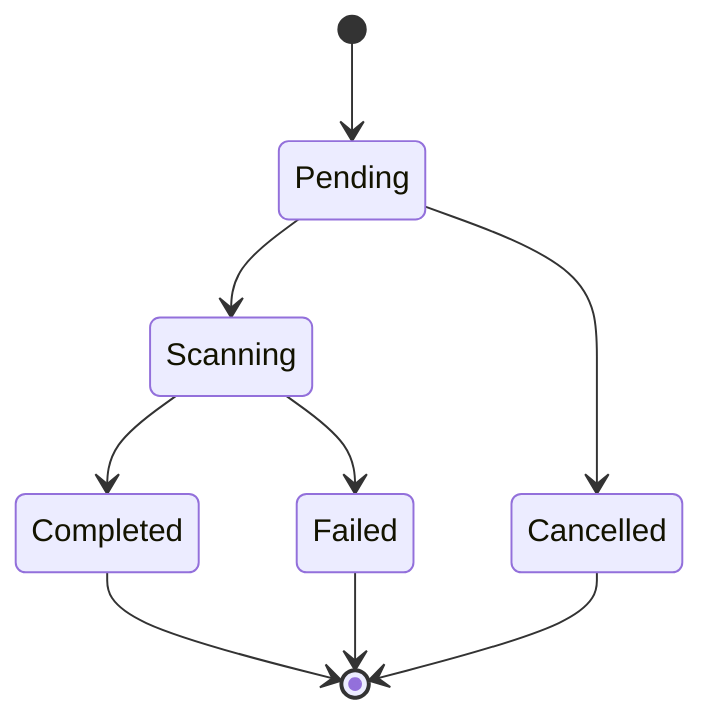
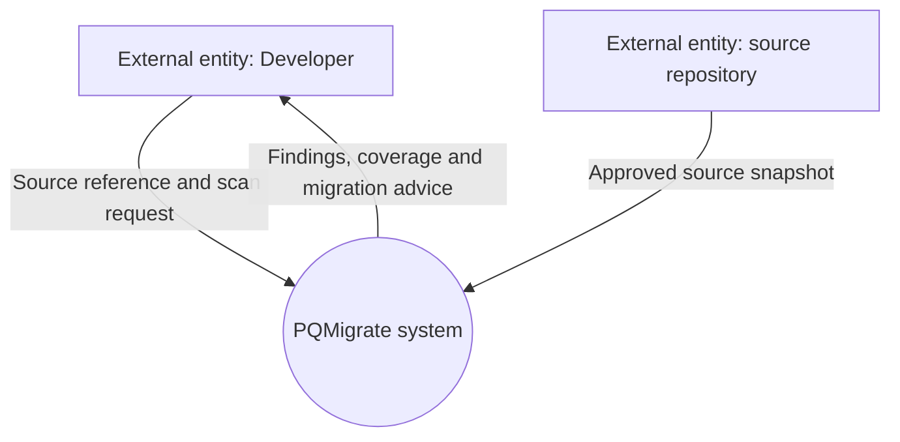
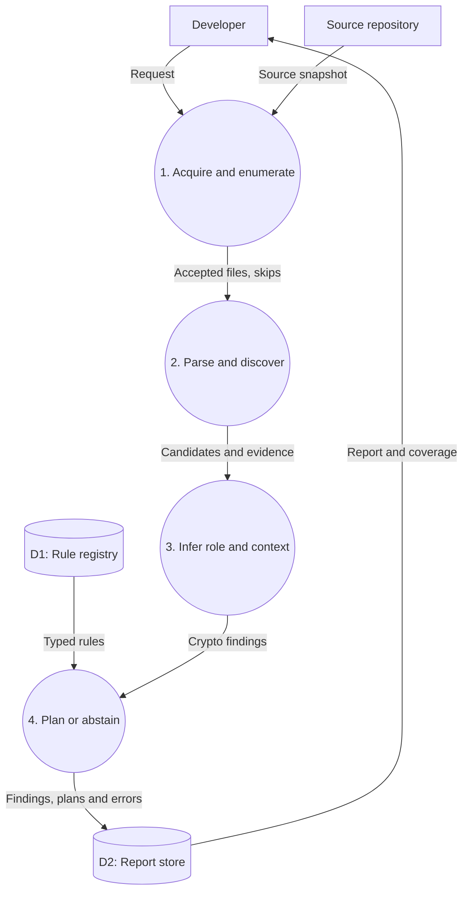

# PQMigrate: 48-hour review packet and implementation plan

**Prepared:** 26 September 2026 (India)  
**Review window:** within approximately two days; confirm the exact meeting time locally  
**Project stage:** Day 5 reported; implementation claims below are subject to source and test verification  
**Audience:** project guide and software engineering review panel

> **Review thesis:** PQMigrate inventories cryptographic operations in source code, records evidence of their purpose, and proposes a post-quantum migration family only when the role and deployment context are sufficiently known. When evidence is insufficient it reports `ABSTAIN` and what must be checked. The present review demonstrates discovery and architecture; validated automated migration is a later milestone.

## 1. The truth table for the review

Do not put a check mark in the final column until the coding agent has supplied the command, exit status, commit and sample output.

| Capability | Current evidence available to this packet | Review wording | Verify before meeting |
|---|---|---|---|
| Python AST scanner and pattern registry | Earlier sprint document reported them | “Implemented, pending this review's verification” | Source tree, actual CLI command, fixture output, test run |
| Go scanning | Earlier document reported a regex-based scanner | “Basic Go detection with documented limitations” | Import alias/negative fixture, output and failure handling |
| Typed CryptoIR/planner and patcher | Agent plan reported classes and files, source unavailable here | “Reported prototype; verify code and enabled rules” | JSON schema, RSA signing fixture, active patch policy |
| Spring backend/JWT/database/React dashboard | Coding agent claimed working system; no repository access here | “Reported integration; live demo only after smoke test” | Build, login, ownership test, fresh scan ID and UI result |
| Context inference, benchmark, SARIF/CBOM, interoperability | Future D6–D14 tasks | “Proposed, with evaluation protocol” | Do not imply implemented |
| Paper-quality empirical accuracy | No independently labelled benchmark supplied | “Evaluation design, metrics pending” | No invented precision or recall |

**Claim control:** A screenshot proves a page rendered. A passing parser fixture proves that fixture. Neither proves safe migration in an arbitrary repository. Show the source commit and scan ID on every review screenshot.

## 2. Two-day execution schedule

This is a review-first schedule, not an attempt to complete D6–D20 in two days. Reserve a full night's sleep before the review. The estimates are focused working hours; move blocks if the meeting is earlier.

| Window | Owner and action | Evidence to produce | Stop condition |
|---|---|---|---|
| **Sep 26 evening, 2–3 h** | Run `git status`, record commit and versions; run Python tests, `mvn test`, frontend build; produce a fresh scan of a tiny owned fixture; classify each subsystem as verified/failed/not checked. | One `review-evidence.md` with exact commands and output references. | If build fails, make CLI fixture demo primary. |
| **Sep 27 morning, 3 h** | Freeze the Day-5 requirement boundary and use-case list; tailor the SRS in §4 to actual commands/endpoints; copy diagrams from §6 into review material. | SRS v0.1, class/sequence/DFD exports or rendered screenshots. | Do not draw an apply-patch API as implemented if it is not. |
| **Sep 27 afternoon, 3 h** | Verify algorithm pseudocode and complexity against actual Python/Go implementation; add three tiny fixtures: RSA sign, RSA encryption/key transport, RSA import-only. Add or fix a safe `UNKNOWN/ABSTAIN` result if feasible. | Fixtures + before/after output + explicit counterexample. | If no operation-aware inference exists, present it as D6 proposal, not a fake demo. |
| **Sep 27 evening, 2 h** | Validate maths with the worked example in §5; rehearse the review from §8; record 2-minute backup screen capture of only working flows. | Printed model, traceability table, backup demo. | Remove any invented benchmark numbers. |
| **Sep 28 before review, 1–2 h** | Run a fresh end-to-end smoke test; check diagrams and spoken claims against current commit; prepare Q&A one-pager. | Timestamped smoke log and 8-minute demo checklist. | If live database/network fails, show pinned local fixture and clearly label it. |

**If time is cut to six hours:** complete baseline evidence, SRS scope, algorithm/pseudocode and two diagrams (class + level-1 DFD), then rehearse. Do not spend those six hours on a new website or an unvalidated patcher.

## 3. Project objective, scope and incremental plan

### Problem and objective

Modern repositories may rely on RSA/ECC in signatures, key exchange, certificates and application protocols. Discovering the name of a primitive is not enough to select a migration: ML-KEM is a key encapsulation mechanism, whereas ML-DSA is a digital signature scheme. The objective is to connect a source-level crypto observation to its operation, evidence, context, and an appropriately constrained migration decision. NIST's migration effort identifies discovery/inventory and interoperability as distinct workstreams. [S1–S3]

### Reviewable Day-5 scope

The minimum reviewable system accepts a local source directory or pinned test fixture; scans supported Python and Go files without executing target code; emits findings with source location and observed primitive/API; and displays a versioned report in CLI or existing dashboard. It preserves parse errors and skipped files. If a role or protocol is unknown, it says so. Authentication/dashboard features can be demonstrated only after the integration smoke test passes.

**Proposed next iteration (D6–D8):** resolve selected calls and key flows, attach evidence-linked role/context, apply typed migration rules and abstain when unresolved. **Later (D9–D20):** benchmark, exports, bounded patch preview, isolated verification, interoperability lab, systematic evaluation and paper draft. These are outcomes to build and measure, not Day-5 accomplishments.

### Actors and use cases

| Actor | Goal | Day-5 status to check |
|---|---|---|
| Developer/Researcher | Submit local repository or approved public snapshot, inspect finding and evidence, export report | Local scan reported; report/UI status to verify |
| Administrator (only if multi-user system works) | Manage access and view own scan history | Backend auth reported; authorization unverified |
| Faculty reviewer | Follow evidence from a sample code line to result, test limitations | Review fixture and slides to prepare |
| Scanner worker | Parse supported files, emit findings and errors without executing source | Verify with test logs |

**Out of review scope:** claiming that generic RSA keys can be rewritten as ML-KEM; arbitrary repository patching; “FIPS certified” tool status; calibrated risk prediction; a completed paper submission.

## 4. SRS v0.1 — software requirements specification

### 4.1 Purpose, users, assumptions

**Purpose:** reproducible inventory and planning for post-quantum migration in supported source languages. **Primary users:** developers, security reviewers, researchers. **Input assumptions:** accessible source tree with supported files and bounded size; a scan does not reveal all cryptography hidden in dependencies, binaries, HSMs or runtime configuration. **Operating constraints:** scanner must read source without importing it; test execution is a separate controlled operation. **Source of truth:** source commit, scanner version, rule-set version and report schema version.

### 4.2 Functional requirements

| ID | Requirement and acceptance test | Priority | Stage |
|---|---|---|---|
| FR-01 | Accept a local directory; enumerate supported files, respect documented exclusions and record number skipped by reason. Test ignored and unreadable fixture. | Must | Day 5 reported, verify |
| FR-02 | Parse Python with AST; find supported crypto API *usages* with path and line. Import-only observations are labelled inventory leads. Test positive and decoy cases. | Must | Day 5 reported, verify semantics |
| FR-03 | Find supported Go crypto APIs; disclose when regex cannot resolve aliases or call targets. Test alias/false-positive cases. | Must | Day 5 reported, verify |
| FR-04 | Export versioned JSON with scan ID, commit/ref if known, timestamp, scanner version, findings, parse failures and skip ledger; CLI exits nonzero on fatal scan failure. | Must | Verify |
| FR-05 | Distinguish `SIGNATURE`, `KEY_ESTABLISHMENT`, `KEY_TRANSPORT`, `HASH`, `UNKNOWN` using linked operation evidence. If unresolved, return `UNKNOWN` with explanation. | Must for D6 | Planned |
| FR-06 | Generate role-aware recommendation: signature → conditional signature-family assessment; key establishment → conditional KEM/hybrid assessment; unknown → abstain. Never emit RSA signature→ML-KEM. | Must for D7–D8 | Planned |
| FR-07 | Provide provenance: finding location, recognized API, observed operation, rule ID, unresolved fields and recommendation prerequisites. | Must for D8 | Planned |
| FR-08 | Display scans, source evidence, findings and unknowns in an authorized dashboard; seeded examples labelled `DEMO`. | Should | Agent-reported UI, verify |
| FR-09 | Preview eligible patch as diff; reject ambiguity or unsupported protocol. Actual apply/rollback requires separate eligible policy and isolated verification. | Later | Planned |
| FR-10 | Export SARIF/CBOM after an accepted CryptoIR schema; validate each against the corresponding spec. | Later | Planned |

### 4.3 Nonfunctional requirements

| ID | Requirement | How to verify |
|---|---|---|
| NFR-01 Correctness | No unsupported claim of signature→KEM; unknown never silently becomes `SAFE`. | Negative role fixtures and rule validation |
| NFR-02 Traceability | Every recommendation refers to rule version, evidence span and source commit when available. | Inspect report against fixture |
| NFR-03 Reproducibility | Same pinned source/scanner/rules produce equivalent canonical findings; timestamps and run IDs are excluded from canonical comparison. | Two runs, normalized output diff |
| NFR-04 Security | Scanning reads source without invoking target code; no shell interpolation; untrusted verification runs only under isolation. | Source inspection, input and worker tests |
| NFR-05 Authorization | A user cannot access another user's scan by guessing its ID when remote multi-user mode is enabled. | Cross-user endpoint test |
| NFR-06 Scalability | Report wall time, file count, bytes, parser failures and peak memory for pinned workloads; no unmeasured “large scale” target. | Timed reproducible runs |
| NFR-07 Usability | User can distinguish confirmed operation, inventory lead, unknown, and verified test result without color alone. | Guided review of UI or CLI output |

### 4.4 Interfaces and data objects

`ScanRequest = {path_or_repo_ref, options, owner?}`. `Finding = {asset_id, path, line, primitive, operation, role, protocol_context, evidence[], rule_ids[], confidence_class}`. `MigrationPlan = {finding_id, candidate_family?, eligibility, blockers[], rationale, standard_refs[]}`. `ScanReport = {schema_version, scan_id, source_commit?, scanner_version, rules_version, counts, skips, errors, findings[], plans[]}`. **Do not expose** full source excerpts by default in a remotely hosted response. Preserve ownership and immutability of stored reports. Existing JSON fields must be mapped or schema-migrated rather than silently changed.

### 4.5 Acceptance scenarios

1. **RSA signing:** a call with proven sign role is labelled `SIGNATURE`, with conditional ML-DSA-family recommendation and protocol/provider caveats; never ML-KEM.
2. **RSA encryption of a session key:** `KEY_TRANSPORT` is labelled only if the encrypted value's use is established; output a KEM/DEM redesign assessment, not a one-line code replacement.
3. **RSA import only:** show `INVENTORY_LEAD` or `UNKNOWN`, no confirmed vulnerable operation or automatic patch.
4. **Malformed file:** produce parse error and scan coverage warning; never grade repo clean on that basis.
5. **Failed worker:** dashboard shows `FAILED`; it never converts empty stdout into zero findings.

## 5. Algorithm analysis and mathematical model

### 5.1 Algorithm to describe at this review

Let source tree (C=\{f_1,\dots,f_m\}), supported rule set (R), and AST nodes (N_i) for each parsed file. The scanner finds candidate source operations, resolves known API symbols, and constructs evidence records. The **Day-5 implementation may have only some of these stages**; the presenter must point at the actual code for each claimed stage.

```text
SCAN(C, R):
  report := new versioned report
  for each accepted file f in deterministic order:
      if unsupported, ignored, oversized: record skip reason; continue
      try: tree := PARSE(f)
      except parse_error: record failure; continue
      for each candidate call/config node c in tree:
          api := RESOLVE_SUPPORTED_SYMBOL(c)
          if api is unknown: continue or record a lead
          evidence := {file, span, api, operation_if_proven}
          role := INFER_ROLE_WITH_BOUND(c, evidence) or UNKNOWN
          plan := PLAN_WITH_PREREQUISITES(role, evidence) or ABSTAIN
          append finding, plan, and decision trace
  return report with coverage ledger
```

**Worked fixture** (three independent observations):

```python
import os
import jwt
from cryptography.hazmat.primitives import hashes
from cryptography.hazmat.primitives.asymmetric import rsa
from cryptography.hazmat.primitives.asymmetric import padding
signing_key = rsa.generate_private_key(public_exponent=65537, key_size=2048)
token = jwt.encode({"sub": "demo"}, signing_key, algorithm="RS256")

transport_key = rsa.generate_private_key(public_exponent=65537, key_size=2048)
session_key = os.urandom(32)
wrapped_key = transport_key.public_key().encrypt(
    session_key,
    padding.OAEP(mgf=padding.MGF1(hashes.SHA256()), algorithm=hashes.SHA256(), label=None),
)

from cryptography.hazmat.primitives.asymmetric import rsa as unused_rsa
```

Observed `jwt.encode` with the linked key supports a `JWT_SIGNATURE` inference, subject to resolving that `jwt` symbol. The `encrypt` call supports an RSA encryption observation; classifying its purpose as `KEY_TRANSPORT` also requires tracking the generated `session_key` into the call. The alias import by itself remains only an inventory lead. This illustrates that **an algorithm symbol is not itself a semantic role**. This fixture is input for source analysis; do not claim its dependencies are installed or that the whole block currently passes an application test.

### 5.2 Formal definitions

For finding (x), evidence set (E(x)) contains directly observed AST spans, resolved symbols, and bounded flow edges. Define:

\[
\rho(x)=\begin{cases}
\mathrm{SIGNATURE}, & \text{if a resolved signing API consumes the tracked key},\\
\mathrm{KEY\_ESTABLISHMENT}, & \text{if a resolved agreement/KEM API is observed},\\
\mathrm{KEY\_TRANSPORT}, & \text{if the tracked key is used to transport a session key},\\
\mathrm{UNKNOWN}, & \text{otherwise.}
\end{cases}
\]

Multiple conflicting observed roles may be represented as a **set of roles** with separate operations; if provenance cannot separate them, keep `UNKNOWN` rather than pretending the primitive has only one use. `HASH` and `MAC` are distinct role classes that can be added without changing the rule. A bare RSA generation call does not satisfy any of the first three conditions.

Let (K(x)) mean known role; (S(x)) mean a relevant approved construction is supported by the *actual provider/protocol*; (I(x)) mean peer/interoperability prerequisites are established; (T(x)) mean required tests exist; (O(x)) mean operator explicitly authorized mutation of an owned copy. Define conservative patch eligibility:

\[
\mathrm{AutoEligible}(x)=K(x)\land S(x)\land I(x)\land T(x)\land O(x).
\]

Use three-valued logic: `true`, `false`, `unknown`. A conjunction is `true` only when **all** terms are demonstrably true; any `false` or `unknown` prevents automatic mutation. **This is a proposed safety model**, not a measured guarantee that a generated patch is secure.

For prioritization, retain a vector rather than inventing a universal “89.3 risk” value:

\[
\mathbf{p}(x)=\bigl(Q(x),H(x),E(x),D(x),M(x)\bigr),
\]

where (Q) = quantum vulnerability of the observed role, (H) = harvest-now-decrypt-later relevance for long-lived confidentiality, (E) = evidence of external exposure, (D) = dependency/peer reach, and (M) = migration readiness. Each dimension is `{high, medium, low, unknown}` with evidence. An unresolved (H) remains unknown; `H` is normally **not** applied to integrity-only signing in the same way as captured encrypted traffic. The dashboard orders by a documented policy only after the reviewer chooses priorities. No unvalidated weighted formula is presented as an empirical model.

**Role-to-family rule table:**

| Observed role | Conditional family | Constraint |
|---|---|---|
| RSA/ECDSA digital signature | ML-DSA or SLH-DSA assessment | Certificate/JWT/SSH format and verifier support required |
| ECDH/X25519 key agreement within supported TLS stack | Standardized ML-KEM hybrid TLS group assessment | Negotiate and verify both endpoints and TLS implementation |
| RSA application key transport | KEM/DEM redesign assessment | Data format, recipient and decrypt-side changes required |
| SHA-256 digest | Record hashing use and security goal | No ML-KEM “replacement” |
| Unknown crypto use | `ABSTAIN` | Human investigation |

NIST FIPS 203 defines ML-KEM; FIPS 204 defines ML-DSA. An automatic `RSA signing → ML-KEM` mapping violates the operation type. [S1–S2] For supported TLS 1.3 hybrid groups, refer to RFC 10024; this does not make RSA certificate authentication itself a KEM problem. [S4]

### 5.3 Complexity and evaluation equations

Let (N=\sum_i |N_i|) be parsed AST nodes, (B) source bytes, (P) tested regex patterns, (F) emitted findings, (D) traversed bounded-flow edges. Python AST construction/traversal is approximately **(O(N))** under ordinary parser behavior; with indexed API lookup, candidate detection is approximately **(O(N+F+D))** after parsing. If every rule is tested on every candidate without indexing, it can grow to **(O(NP))**. The existing Go regex approach may require **(O(PB))** work for bounded/linear patterns and may be worse for pathological regex; do not claim general linear time. AST memory is **(O(N+F+D))** for the in-memory tree, evidence and bounded graph, subject to implementation choices. Record measured scan time instead of quoting asymptotics as a benchmark result.

For a labelled evaluation set: (\mathrm{precision}=TP/(TP+FP)), (\mathrm{recall}=TP/(TP+FN)), (F_1=2PR/(P+R)) when denominators are defined. Count **operations at matched source spans**. Imports and parse failures are accounted for separately. A second task measures role accuracy only on gold operations, with answer coverage = answered/gold; report error among answered *and* coverage. These equations are **evaluation design**, not today's measured performance.

## 6. UML and data-flow diagrams for the review

The diagrams below distinguish current and planned behavior in presentation labels. Adjust names and method signatures to the actual code after the baseline audit. If the panel asks for strict UML use-case notation, draw a system boundary with the actors/use cases from §3 in draw.io; the class, sequence and state diagrams below already use UML-style concepts.

### 6.1 UML class diagram (target domain model)



**Review point:** a finding is an observation; a migration plan is conditional advice. They are separate objects. If actual Day-5 classes differ, mark this a target domain model.

### 6.2 UML sequence diagram (current flow plus future inference)



**Status:** API and UI were agent-reported; bounded job execution and semantic plans may be future work. In the live review, identify which arrows ran and which are target architecture.

### 6.3 UML state diagram (scan lifecycle)



`Failed` and `Cancelled` cannot be interpreted as “no quantum-vulnerable findings.”

### 6.4 DFD level 0 (context diagram)



**Trust boundary:** an external repository is untrusted input; the scanner reads it. A verification test runner, if later enabled, is a separate controlled boundary.

### 6.5 DFD level 1 (decomposition of PQMigrate system)



**Balancing:** the level-0 system's incoming request/source become level-1 inputs; the findings/report output becomes the level-1 report flow to Developer. `D1/D2` are internal data stores, not external users. Current Day-5 may implement P1/P2 only; P3/P4 are the next build stages.

### 6.6 Requirements-to-diagram traceability

| Requirement | Diagram element | Demo evidence |
|---|---|---|
| FR-01 | DFD P1, ScanJob | scan summary/skips |
| FR-02/03 | DFD P2, CryptoFinding | source line and detected API |
| FR-04 | ScanReport, D2, scan state | versioned JSON and failed case |
| FR-05/06/07 | DFD P3/P4, MigrationPlan | three role fixtures, initially proposal if not built |
| FR-08 | sequence UI/API/store | authenticated UI with fresh scan ID if verified |
| FR-09 | plan eligibility | future patch preview and refusal tests |

## 7. What to implement immediately after the review

| Milestone | Implementation | Exit evidence |
|---|---|---|
| M1 — role/context | Python supported call resolution and bounded dataflow; separate bare import from observed operation. | Positive/negative fixtures; no RSA signature→KEM. |
| M2 — typed planning | Rule registry with role predicates, standard references, refusal reasons and evidence trace. | Schema validation; signing/key agreement/unknown cases. |
| M3 — pilot benchmark | Prewritten annotation guide, 60–100 cases with held-out split and labelled unknowns. | Metrics script with raw predictions and error cases. |
| M4 — exports and UI | SARIF/CBOM from stable schema; dashboard displays uncertainty and provenance. | Schema validation and a real fresh scan through UI. |
| M5 — migration assurance | Narrow safe patch preview, isolated worktree and controlled verification; actual TLS negotiation if available. | Patch/compile/test/rescan/interoperability funnel with failure counts. |
| M6 — paper study | Broader pinned real-repo sample and honest baselines; faculty feedback. | Draft with measured claims and reproducibility appendix. |

**Architecture choice:** keep the Python scanner as the source of crypto semantics; Spring orchestrates jobs/auth/storage and React presents evidence. Duplicating crypto rules in Java and Python will create conflicting decisions. The public research website is separate from a local/private analysis dashboard.

## 8. Eight-minute presentation script

| Time | Present | Precise line to say |
|---|---|---|
| 0:00–0:50 | Problem | “An RSA import does not tell us if the key signs tokens or transports a secret. We aim to discover the operation before planning migration.” |
| 0:50–1:40 | Scope/status | “We are at Day 5. Here are the verified scanner components and the tests. Context inference and automated assurance are next milestones.” |
| 1:40–2:40 | SRS | Show FR-01–07, NFR-01–05; point to `UNKNOWN`/`ABSTAIN` and coverage ledger. |
| 2:40–3:50 | Algorithm and maths | Walk through the three-line RSA fixture; explain role function (\rho(x)), three-valued auto-eligibility and time complexity. |
| 3:50–5:10 | UML | Show class and sequence; distinguish finding from plan and failing scan from clean scan. |
| 5:10–6:10 | DFD | Trace request/source → parse → evidence → planned inference → stored report. |
| 6:10–7:15 | Live demo | Run pinned fixture and show source line, JSON and UI if verified. Show an import-only/unknown case. |
| 7:15–8:00 | Roadmap and feedback | Give M1/M2 targets and ask reviewer which contexts and ground-truth criteria require tightening. |

**Backup:** a clean CLI scan with preserved stdout and a commit SHA. If the backend breaks, say exactly that and demonstrate the engine. Do not pass a seeded dashboard off as a fresh scan.

### Slide assembly checklist

| Slide | Title | Must show |
|---|---|---|
| 1 | Problem and project claim | RSA sign vs RSA key transport in two source snippets; role matters |
| 2 | Day-5 baseline | Verified modules and commands, current commit, explicit proposed items |
| 3 | SRS | FR-01–07 and NFR-01–04, acceptance scenarios and scope |
| 4 | Algorithm | Pseudocode, three-case fixture and AST/regex limitations |
| 5 | Mathematical model | Role function, three-valued eligibility and complexity assumptions |
| 6 | UML | Class + sequence with finding separate from migration plan |
| 7 | DFD | Level 0 and level 1, balanced inputs/outputs and trust boundary |
| 8 | Demo + next milestones | Fresh scan ID, evidence, unknown case, M1–M3 with measurable exit gates |

Add tiny source citations in slide notes for NIST role definitions. Put tool-generated metrics on a slide **only** if the raw run, denominator and code revision are available. Bring this full packet as appendix for detail that does not fit eight slides.

### Paste this task to the local coding agent

> We have a faculty review within two days focused on algorithm analysis, mathematical model, SRS, UML and DFD. We are at Day 5. Use `PQMigrate_48h_Review_Packet_SRS_Models_Diagrams_2026-09-26.md` as the review specification. First capture `git status`, commit, runtime versions, Python tests, Maven tests, frontend build, and one fresh versioned scanner JSON report. Write `review-evidence.md` with verified/failed/not-checked status for each subsystem. Reconcile the packet's SRS fields and diagrams with actual source; mark any future component planned. Prepare three owned fixtures for RSA JWT signing, RSA encryption of a generated session key, and import-only, and check whether the current scanner handles each; do not fabricate role inference. If a safe Day-5 patch is small, make import-only `INVENTORY_LEAD` and unknown role explicit without changing true detections; test it. Render the class, sequence and DFD diagrams for an eight-slide review; show a fresh scan ID and command output. Return changed files, exact test commands, outputs, a failure list and a backup CLI demo. Stop adding unrelated features until the review is ready.

**Final physical/digital packet:** eight slides or equivalent review pages, this SRS/model document, rendered diagrams, source commit, `review-evidence.md`, three fixture files, one JSON report, raw test logs and a short backup demo recording. Check every slide against its source artifact the morning of the review.

## 9. Questions the panel may ask

| Question | Accurate response |
|---|---|
| Why RSA → ML-KEM is wrong sometimes? | ML-KEM establishes shared keys; RSA can sign, encrypt or identify a peer. RSA signatures need a signature migration assessment, often ML-DSA/SLH-DSA depending on protocol support. [S1–S2] |
| Is this an AI model? | Current system is rule-based static analysis. Evidence traces are explainable decisions. There is no trained model unless one is later added and evaluated. |
| Is your risk score mathematically validated? | We use a transparent multi-dimensional policy with unknowns; we have not calibrated a scalar probability. The model defines decision constraints, not empirical accuracy. |
| How do you avoid false positives? | Link resolved calls to operations, retain unknowns, label import-only leads, maintain negative fixtures, then measure precision/recall on held-out annotated cases. |
| Does passing pytest prove a patch safe? | No. It shows only the checks that ran in that isolated environment; interoperability, protocol semantics and unsupported consumers remain separate conditions. |
| Where is the novelty? | We are testing whether role-aware planning and abstention add value beyond inventories. Cryptoscope already performs crypto-asset analysis, so novelty must be demonstrated by a comparative evaluation, not asserted. [S5] |
| Why is the dashboard part of the project? | It gives traceability from source evidence to advice and tests. The research result comes from correctness and measured evaluation, not UI polish. |

## 10. Source references

- [S1] [NIST FIPS 203: ML-KEM](https://csrc.nist.gov/pubs/fips/203/final).
- [S2] [NIST FIPS 204: ML-DSA](https://csrc.nist.gov/pubs/fips/204/final) and [FIPS 205: SLH-DSA](https://csrc.nist.gov/pubs/fips/205/final).
- [S3] [NIST NCCoE Migration to PQC workstreams](https://www.nccoe.nist.gov/applied-cryptography/migration-to-pqc).
- [S4] [IETF RFC 10024: hybrid TLS 1.3 groups](https://datatracker.ietf.org/doc/html/rfc10024).
- [S5] [IBM Research: Cryptoscope](https://research.ibm.com/publications/cryptoscope-analyzing-cryptographic-usages-in-modern-software).

**Review completion criterion:** the faculty can select one documented finding, locate its source evidence, understand the scope of the mathematical decision rule, match it to the SRS and diagrams, and see which stages are working today. That is a strong Day-5 review without pretending the paper has already been written.
