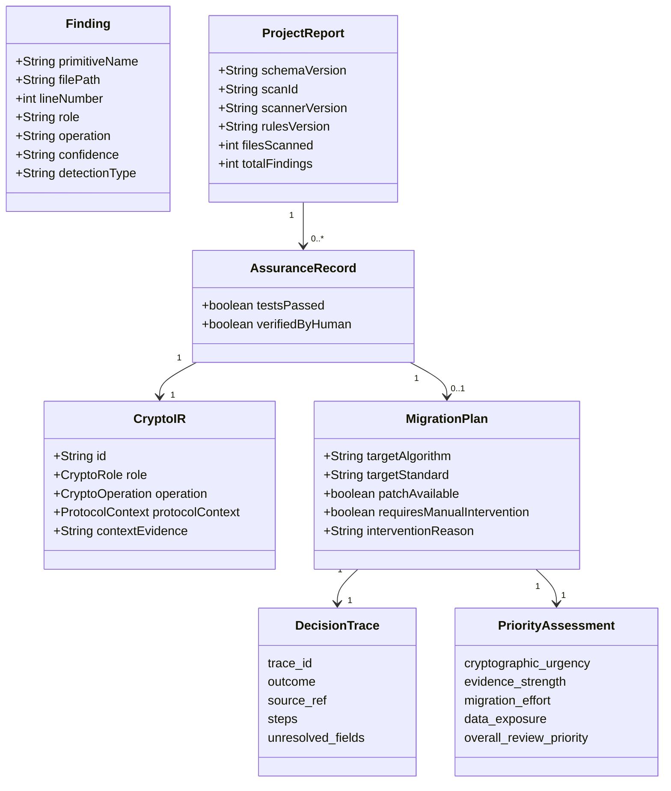
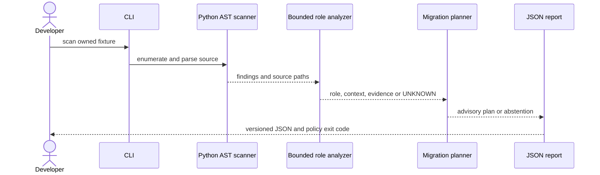
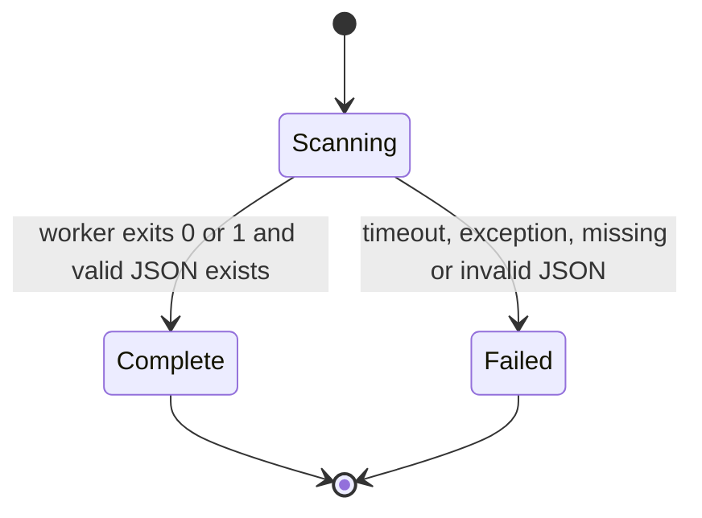
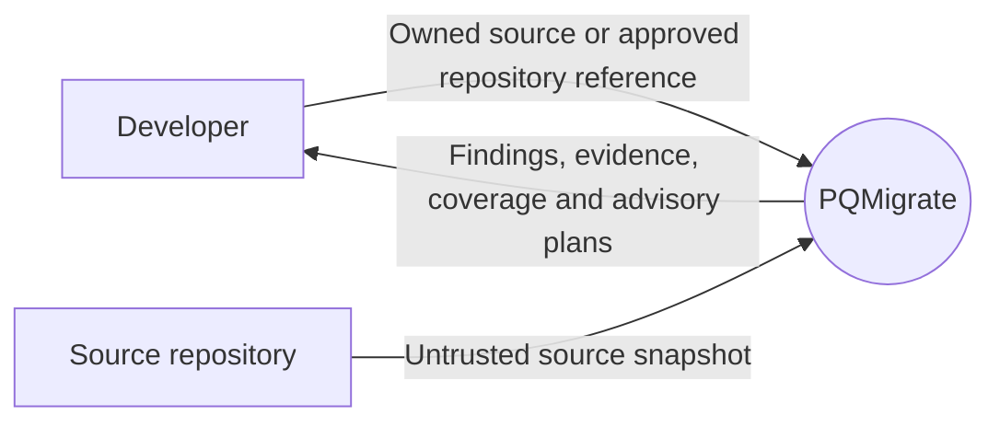
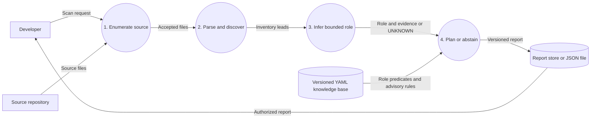

# PQMigrate review diagrams

The diagrams distinguish implemented behavior from planned work. Mermaid source remains editable and can be rendered later if requested.

## Current domain model

## Current CLI sequence

## Backend scan lifecycle

`FAILED` never means zero findings. Missing worker output now fails closed.

## DFD level 0

## DFD level 1

## Target extension after the review

SARIF/CBOM export, a labelled benchmark, isolated patch verification, and interoperability tests remain later milestones. They do not appear as completed processes in the current diagrams.
